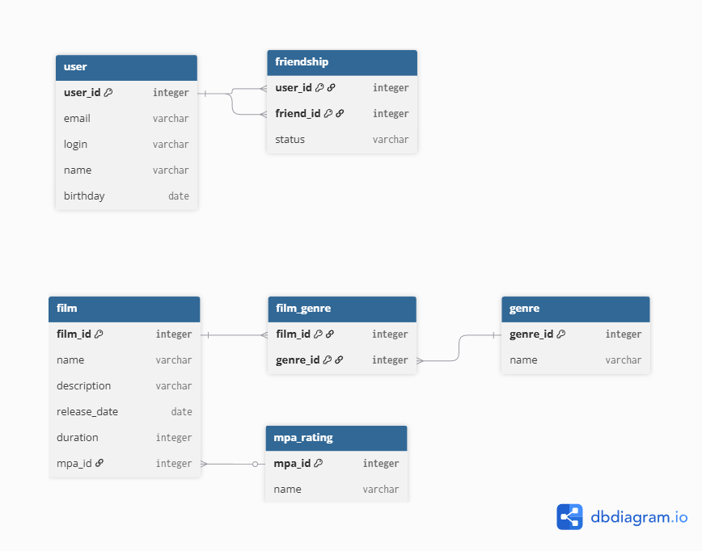

# java-filmorate

[Скачать ER-диаграмму](docs/er_diagram.png)

# ER-диаграмма базы данных Filmorate

Диаграмма отображает структуру базы данных приложения Filmorate:

- Таблица `film` хранит фильмы, с ссылкой на рейтинг MPA (`mpa_rating`) и жанры через таблицу `film_genre`.
- Таблица `genre` содержит список жанров.
- Таблица `user` хранит пользователей, а таблица `friendship` — их дружеские связи со статусом (`confirmed` / `unconfirmed`).
- Таблица `film_likes` (не показана на диаграмме) хранит лайки пользователей для реализации топ-N популярных фильмов.
